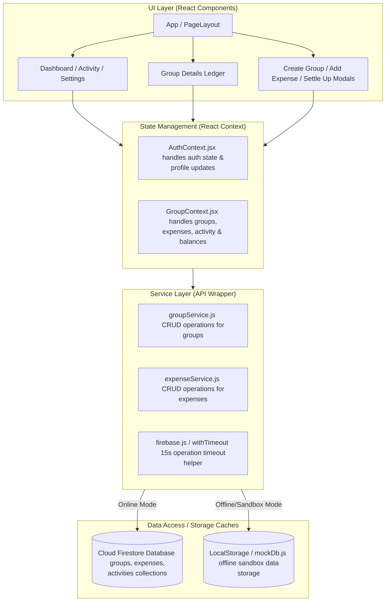
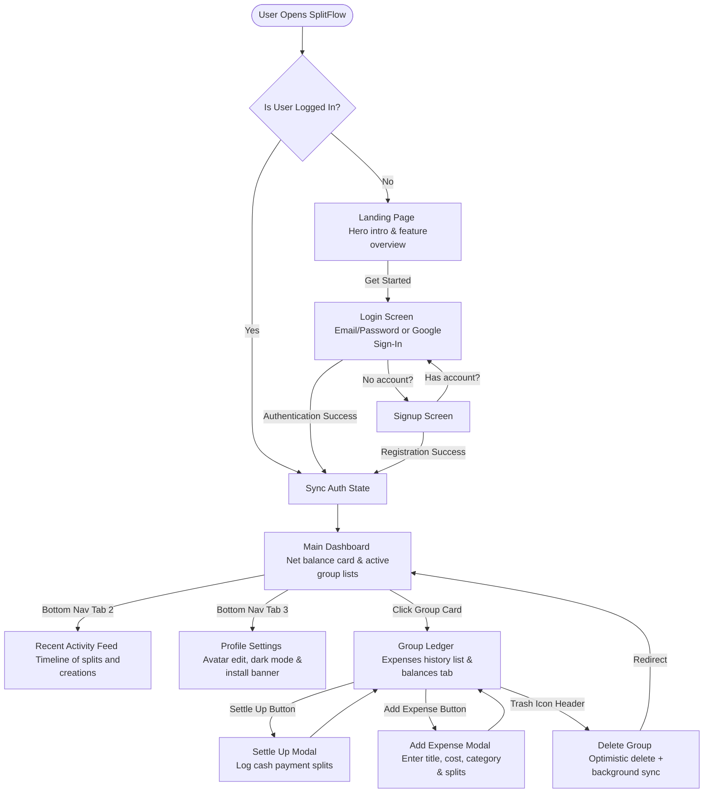

# SplitFlow 💸

SplitFlow is a premium, mobile-first, full-stack Progressive Web Application (PWA) designed for seamless expense splitting and bill tracking among friends. Inspired by Splitwise's ledger-based utilities and CRED's fintech aesthetic, it features a glassmorphic interface, real-time cloud database syncing, and a robust offline-first fallback architecture.

---

## 🌟 Key Features

* **Fintech Glassmorphic UI**: Tailored color palettes, sleek dark modes, linear gradients, and micro-animations built using Vanilla CSS.
* **Real-time Cloud Syncing**: Instant synchronization of groups, expenses, and activity logs across members using Cloud Firestore.
* **Intelligent Offline Sandbox Fallback**: Automatic detection of poor network connectivity or unconfigured databases. The app seamlessly degrades to a client-side localStorage mock database (`mockDb`) within 1.5 seconds, ensuring the UI never freezes.
* **Smart Balance Simplification**: Computes net balances for all members inside a group and simplifies debts to minimize the total number of cash transactions.
* **Standalone PWA Mode**: Installs directly onto smartphone home screens (Android & iOS) to run full-screen, hiding browser banners, URL bars, and tabs.

---

## 🏗️ System Architecture

SplitFlow follows a layered architecture that decouples UI rendering, state management, backend network APIs, and data caches:



---

## 🔄 User Workflow & Navigation

The application navigation is structured as a state machine that dynamically switches views to maintain a fluid, app-like smartphone experience:



---

## 🛠️ How It Works (Technical Details)

### 1. The Firestore Caching & Offline Sandbox Fallback
When the application starts, it registers a real-time `onSnapshot` listener on the Firestore `groups` collection.
* **Safety Timer**: A 1.5-second timer runs in the background. If the Firestore snapshot fails to resolve within 1.5 seconds (due to network blockages, latency, or missing firebase configurations), the app prints a warning to the console, displays an offline warning toast, and triggers `fallbackToMock()`.
* **Simulated mockDb**: In sandbox/offline mode, the app reads and writes data to LocalStorage using a fully functional mock backend schema (`mockDb.js`). As soon as internet connectivity or configuration is restored, the app swaps back to the live Cloud database.

### 2. Decoupled safe event-loop (setTimeout)
To prevent network delay or database failures from locking up the interface, all database writes (creating a group, deleting a group, or adding an expense) are separated from state updates:
* The primary transaction completes and updates the Firestore collections.
* The secondary dashboard re-fetches (`loadGroups()`, `loadActivities()`, `refreshGlobalBalances()`) are wrapped inside a zero-delay `setTimeout(..., 0)`.
* This decouples the updates. Even if a background refresh query fails, it executes in a separate loop tick. It will never bubble up to throw errors in the main UI action, ensuring that success toasts display correctly and modals or details screens redirect immediately.

### 3. Smart Balance Calculation & Simplification
Inside [balanceCalculator.js](file:///c:/Users/Ashu/Desktop/codes/SplitFlow/src/utils/balanceCalculator.js), the system computes splits:
* **Net Balances**: Accumulates how much each member has paid versus how much they owe across all group expenses.
* **Debts Simplification**: Groups members into two lists: **Creditors** (those owed money) and **Debtors** (those who owe money). Using a greedy search algorithm, the debtor with the largest debt pays the creditor with the largest credit. The balance is updated, and the loop continues until all net balances are resolved. This minimizes the total number of manual settlement transactions.

---

## 💻 Local Installation & Setup

### Prerequisites
* [Node.js](https://nodejs.org/) (v16 or higher)
* [Firebase Account](https://console.firebase.google.com/)

### Steps to Run Locally

1. **Clone and Navigate**:
   Ensure you are in the `/SplitFlow` directory of your workspace:
   ```powershell
   cd c:\Users\Ashu\Desktop\codes\SplitFlow
   ```
2. **Install Dependencies**:
   Install all required Node modules:
   ```powershell
   npm install
   ```
3. **Configure Environment Variables**:
   Create a `.env` file in the root folder of the project. Fill it in with your Firebase project configurations:
   ```env
   VITE_FIREBASE_API_KEY=your_api_key
   VITE_FIREBASE_AUTH_DOMAIN=your_project.firebaseapp.com
   VITE_FIREBASE_PROJECT_ID=your_project
   VITE_FIREBASE_STORAGE_BUCKET=your_project.appspot.com
   VITE_FIREBASE_MESSAGING_SENDER_ID=your_sender_id
   VITE_FIREBASE_APP_ID=1:your_sender_id:web:your_app_id
   ```
   *Note: If no `.env` file is present, or the values are left empty, the application will automatically start in offline sandbox mode.*

4. **Apply Firestore Security Rules**:
   Publish the security rules inside the **Firestore Database > Rules** tab in your Firebase console:
   ```javascript
   rules_version = '2';
   service cloud.firestore {
     match /databases/{database}/documents {
       
       // Allow authenticated reads and writes
       match /groups/{groupId} {
         allow read, write: if request.auth != null;
       }
       match /expenses/{expenseId} {
         allow read, write: if request.auth != null;
       }
       match /activities/{activityId} {
         allow read, write: if request.auth != null;
       }
     }
   }
   ```
5. **Run the Development Server**:
   Start the local Vite dev server:
   ```powershell
   npm run dev
   ```
   Open [http://localhost:5173](http://localhost:5173) in your browser.

---

## 📱 Mobile Installation (PWA Guide)

Since SplitFlow is a fully configured Progressive Web App, you can install it directly onto your mobile phone to use it like a native app.

### Installation Instructions

#### On Android (Chrome / Edge):
1. Open your deployed URL (e.g., `https://your-app.vercel.app`) in the browser.
2. Tap the browser notify banner: **"Add SplitFlow to Home Screen"** or select **Install App / Add to Home screen** from the browser's three-dot settings menu.
3. Tap **Install**. The SplitFlow icon will now appear on your home screen and app drawer.

#### On iOS (Safari):
1. Open the deployed URL in Safari.
2. Tap the **Share** button (box with an arrow pointing up) in the bottom navigation bar.
3. Scroll down the sharing menu and select **"Add to Home Screen"**.
4. Confirm by tapping **Add** in the top-right corner. The SplitFlow icon will appear on your iPhone home screen.

---

## 📦 Production Build

To compile and minify the frontend assets for production:
```powershell
npm run build
```
Vite will output the compiled build in the `/dist` directory. This directory is ready to be deployed to static hosting platforms like Vercel, Firebase Hosting, or Netlify.
